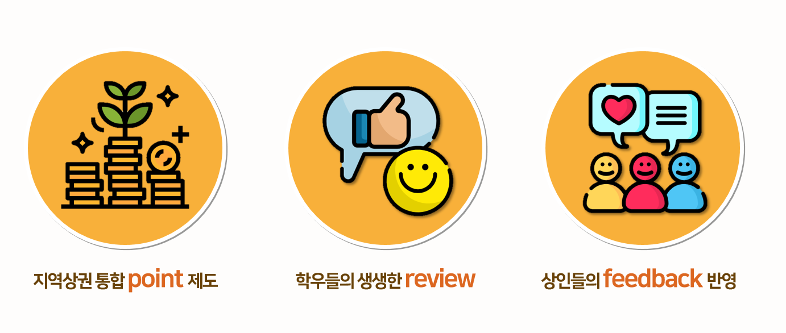
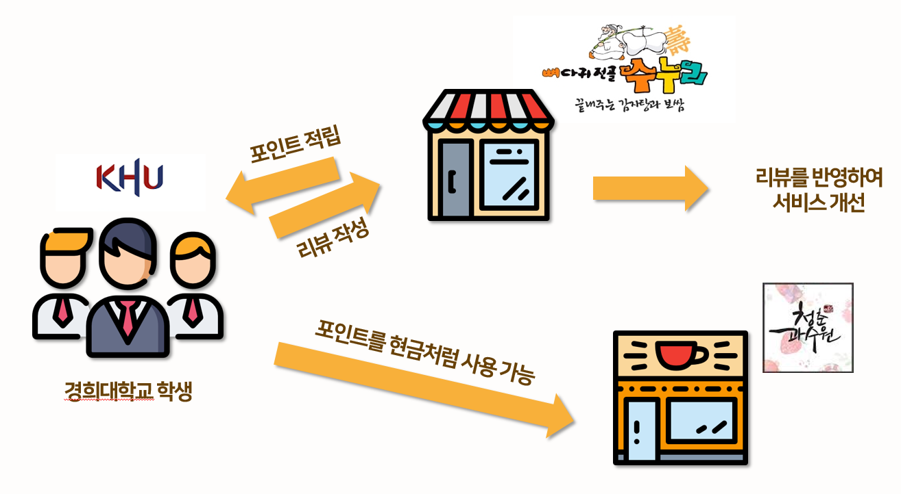

# 2018-khuthon

## 먹KHU감 프로젝트
### 프로젝트 소개
2018 KHUTHON에 지원하는 GAMSUNG팀의 **먹KHU감** 프로젝트는 대학교와 지역상권을 연결하여 지역 상권을 활성화하고, 거짓 홍보가 없는 진짜 정보를 대학생들이 스스로 구축하고 활용하여 서로 윈윈할 수 있는 플랫폼을 형성하고자 하였습니다.

* 지역상권 통합 POINT 제도
* 학우들의 생생한 REVIEW
* 상인들의 FEEDBACK 반영을 통한 발전

위 세 가지 토픽을 중심으로 경희대학교와 주변의 지역상권을 연결하는 먹KHU감이라는 사이트를 제작하였습니다.

### 시나리오
경희대학교 학생들은 매장에 있는 QR코드를 통해 리뷰를 작성하고, 포인트를 적립할 수 있고 적립한 포인트는 지역의 제휴매장에서 현금처럼 활용할 수 있습니다. 

지역의 매장들은 홍보 비용을 들이지 않더라도 사이트를 활용하는 학생들에게 홍보가 가능하고, 학생들이 등록한 리뷰를 바탕으로 서비스의 품질을 개선할 수 있습니다.

### 구현 방법

#### 학교 인증하기
경희대학교의 **인포 21** 에서 ID와 PW 정보를 추출하고, 데이터베이스에 등록하는 과정을 통해 본교 학생임을 인증하는 절차를 수행하도록 합니다.

#### 포인트 적립 / 리뷰 작성하기
제휴 매장에 배치되어 있는 QR코드를 보유한 단말의 카메라로 인식한 후, 로그인 페이지에서 회원가입한 정보로 로그인합니다.

* 포인트 적립
* 포인트 결제
* 리뷰 쓰기

로그인에 성공하면 위 항목 세 가지를 선택할 수 있는 페이지가 띄워집니다. 매장에서 일정 포인트를 적립하거나 포인트를 사용하여 결제할 수 있고, 매장에 대한 리뷰를 작성할 수도 있습니다.